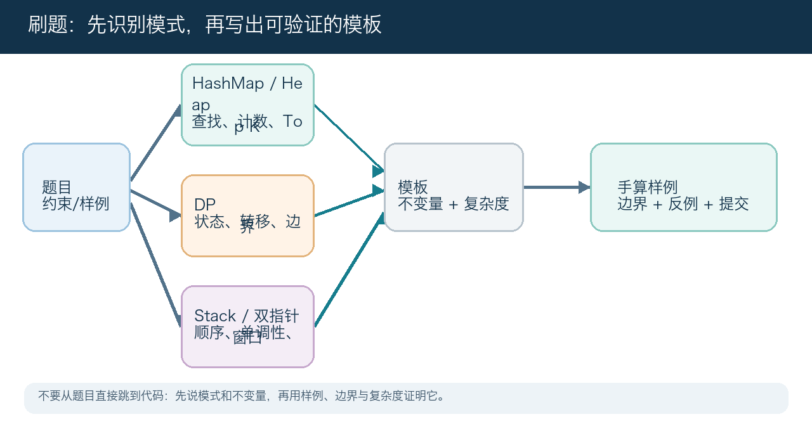
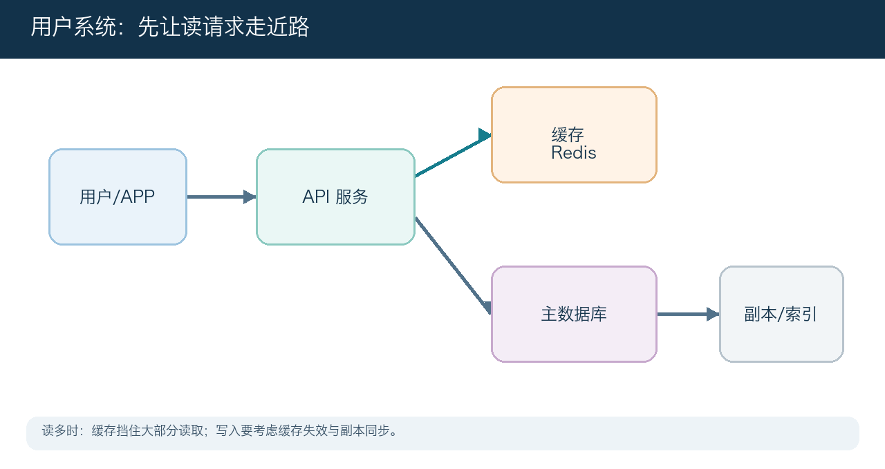
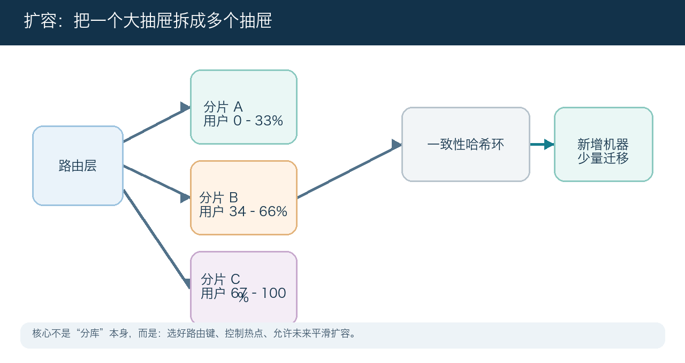
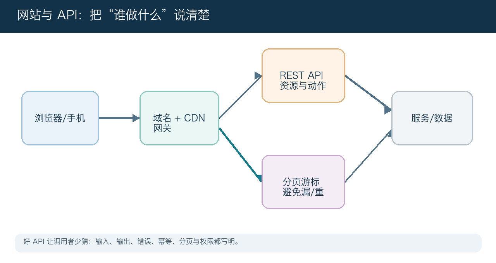
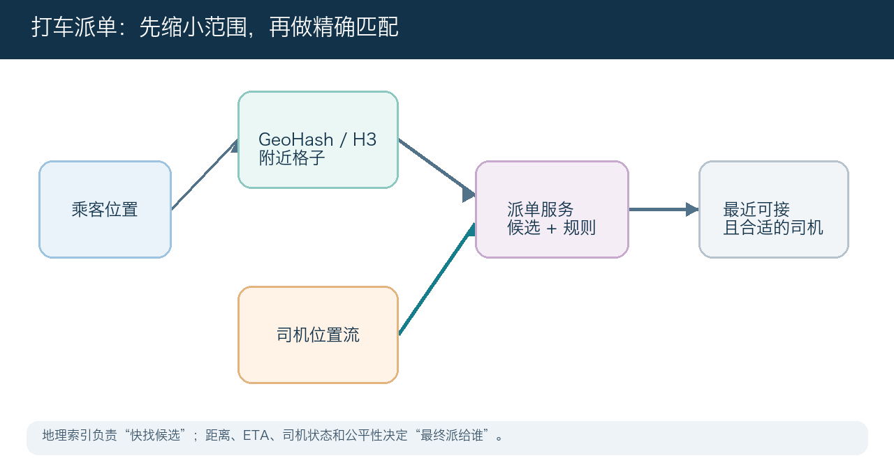
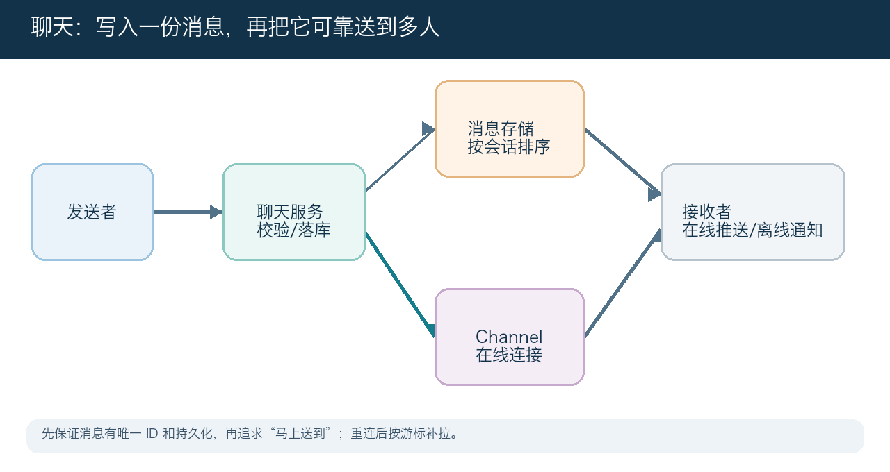
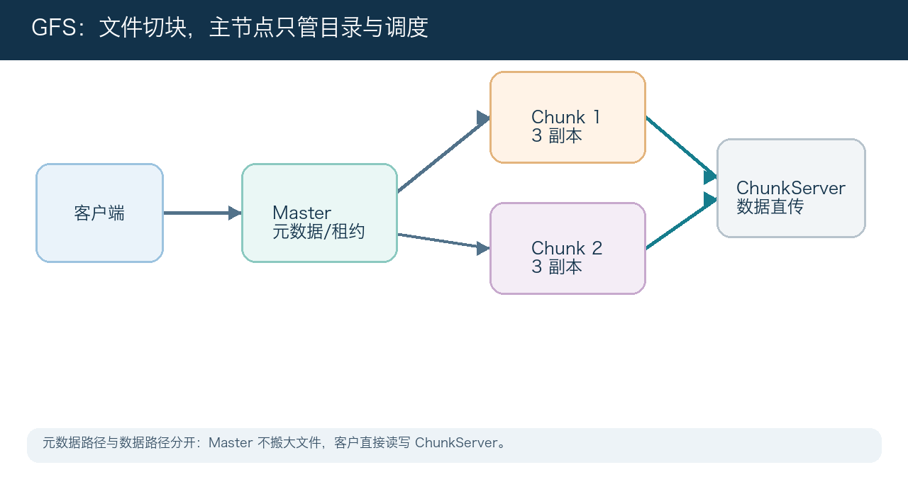
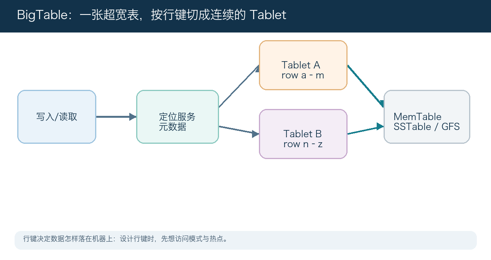
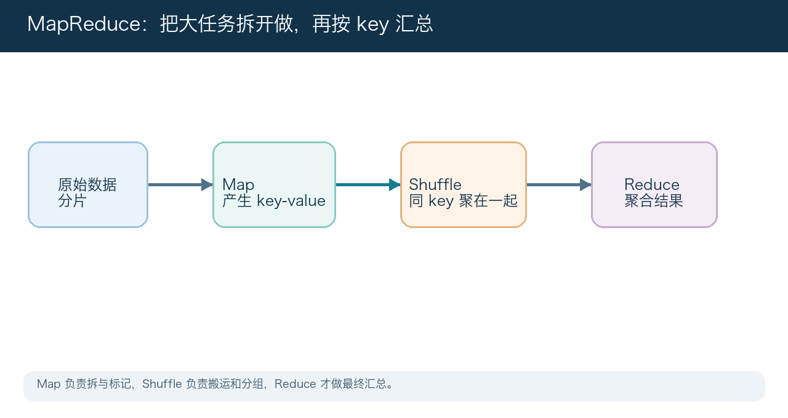
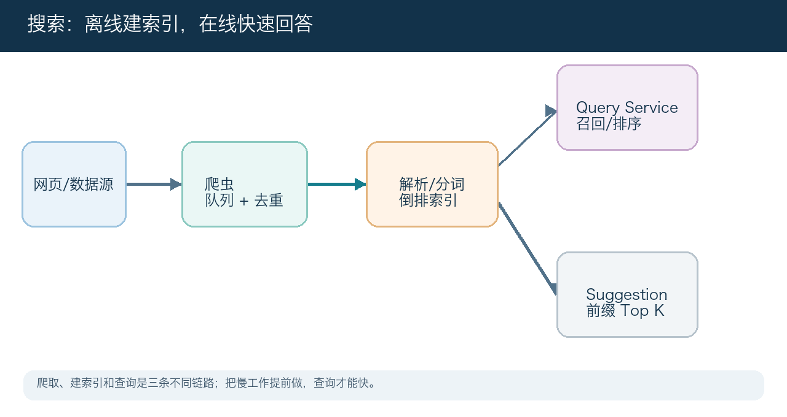

# 刷题与系统设计白话讲义（2026 面试版）

> 可直接阅读的图文学习资料。在线阅读：[tonytan.me/system-design/](https://tonytan.me/system-design/)

- 用白话说明核心概念，并补充面试要点、常见坑和可复用的算法模式。
- 包含算法刷题、系统设计、开发与求职补充，以及现代架构面试视角。

## 怎么读

先看算法刷题练模式识别和模板；再练系统设计口述；最后用文末工作簿做模拟面试。

## 第一部分：算法刷题

_先看约束，再选数据结构；每题都能说清不变量、复杂度和边界_

刷题不是把题号背下来，而是把题目翻译成可复用模式：查找/计数用 HashMap，Top K 用 Heap，最优子结构用动态规划，嵌套或顺序约束用 Stack，已排序或单调关系用双指针/二分。每次都先手算小样例，再写代码。

### 1. Heap 与 HashMap：先把“找什么”变成可快速查询的数据结构

HashMap 适合“根据 key 立刻找到答案或计数”：Two Sum 用 value→下标，异位词/频率题用元素→次数。Heap（优先队列）适合反复拿当前最小/最大：Top K、合并 K 个有序链表、任务调度。先问题目是要精确查找、计数、还是持续取极值；这比背 API 更重要。

> **面试要点：** 写清 Map 的 key/value 含义，Heap 是小顶还是大顶、容量是否始终为 K；时间复杂度通常是 Map 的 O(n) 或 Heap 的 O(n log k)。

> **常见坑：** 把全部元素排序来做 Top K（O(n log n)），或在 Map 中先覆盖旧下标却没处理“先查后写”的 Two Sum 顺序。

### 2. 动态规划 I：状态、转移、初始值三件事

动态规划适用于问题可拆成重复子问题，且当前最优答案可由更小子问题推出来。先用一句话定义 dp[i] 或 dp[i][j] 的意思，例如“到第 i 个位置的最大收益”；再写它从哪些更小状态来、初始值是什么、最终读哪个格子。不要一开始就压缩空间。

> **面试要点：** 面试/刷题时按“状态含义 → 转移方程 → base case → 遍历顺序 → 答案位置”口述；先画 n=3 或 n=4 的表格验证。

> **常见坑：** 只会说‘用 DP’，却无法解释 dp 数组每个位置代表什么；或初始化为 0 导致不可达状态被当作可达。

### 3. 动态规划 II：背包、二维状态与遍历方向

当题目有两个资源限制（例如 0 和 1 的数量）或“选/不选”物品时，常需要二维 DP。0/1 背包代表每件只能用一次，容量必须倒序遍历；完全背包允许重复使用，容量正序遍历。像 Ones and Zeroes 这类题，dp[i][j] 表示在 i 个 0、j 个 1 的预算内最多选多少个字符串。

> **面试要点：** 遇到‘最多/最少/能否/方案数’，先判断是 0/1 还是可重复；明确每一维资源，按不会重复使用当前物品的方向更新。

> **常见坑：** 背包循环方向写反，使同一个物品在一轮内被重复选择；或没有为字符串/物品的代价预计算。

### 4. Stack：用后进先出保存“还没处理完的过去”

栈适合匹配嵌套关系（括号）、撤销最近操作、或保留还没有找到答案的元素。Min Stack 的关键是让每一层同时知道‘到这里为止的最小值’，因此 push/pop/getMin 都是 O(1)。单调栈则让栈内元素一直递增或递减，用来找下一个更大元素、每日温度、柱状图最大矩形。

> **面试要点：** 说明栈里存的是值、下标还是 pair(value, currentMin)；单调栈要说清何时弹栈、弹出元素的答案何时确定。

> **常见坑：** 只会用普通 stack，却在 Min Stack 的 getMin 时遍历整个栈；或遗漏相等元素导致单调栈边界错误。

### 5. Hard Problems I：把“大难题”化为一个可验证的不变量

难题往往不是靠更长代码，而是先找到一个把搜索空间减半的不变量。两个有序数组的中位数可在较短数组上二分切分位置：左半部分元素数量正确，并且左边最大值不大于右边最小值时，切分就成立。边界用 ±∞ 或条件分支统一处理。

> **面试要点：** 先选更短数组二分，写出两个交叉比较条件；每一次移动都要能解释为什么当前切分不可能正确。复杂度目标是 O(log min(m,n))。

> **常见坑：** 把两个数组合并再取中位数，虽然容易写但没满足题目对对数复杂度的要求；或没处理空数组、奇偶总长度。

### 6. Two Pointers：用两个位置维护一个区间或一次配对

双指针不是固定模板，而是两根指针各自承担不同职责。左右夹逼适合有序数组的两数之和、盛水容器、去重；快慢指针适合链表环与原地删除；滑动窗口适合连续子数组/子串。每一步移动前都要说清：移动它以后，哪些候选已经被安全排除。

> **面试要点：** 先给窗口/指针的含义和不变量；有序数组里根据比较结果只移动一边，窗口题则维护计数并在不满足条件时收缩。

> **常见坑：** 两个指针无条件一起移动，跳过解或陷入死循环；窗口题没有在左指针移动时撤销计数。

## 补充视频：开发与求职

### 1. C# / ASP.NET Core 开发环境补充

先区分运行时 SDK 和编辑器：安装当前受支持的 .NET SDK 后，用 `dotnet --info` 验证；控制台项目可从 `dotnet new console` 开始，Web API 则从 `dotnet new webapi` 开始。刷题时先把输入、输出、边界和复杂度写清，框架项目里则把路由、依赖注入、配置和错误处理分开。

> **面试要点：** 环境问题先用最小项目验证，而不是把错误归咎于业务代码；提交项目时不要把本机机密、构建产物和用户配置提交进仓库。

> **常见坑：** 只安装 IDE 却没有可用 SDK，或把连接串/API Key 硬编码在源码中。

### 2. 简历修改讲座：把学习成果写成可验证的影响

一条简历经历应让读者看懂：你解决了什么问题、用了什么方法、结果如何衡量。推荐用‘动作 + 对象 + 方法/约束 + 结果’：例如‘将搜索查询 p95 从 300 ms 降至 90 ms，通过缓存与索引重构’。刷题和系统设计可以写成能力证明，但不要只罗列题数或名词。

> **面试要点：** 每条重点经历可被追问：数据从哪里来、你的角色是什么、指标怎样计算、失败时怎么办。英文动词和数字要准确，无法证实的夸张描述会在面试中失分。

> **常见坑：** 把课程、技术栈和项目名称堆成清单，却没有你的贡献、规模和可验证结果。

## 第 02 章：用户系统、缓存与关系数据

_从一个登录页，学会估算流量与选择存储_

这一章把“用户系统”当作第一个系统设计练习。你会看到：访问量先怎么算；读多时为什么要加缓存；登录与好友关系为什么不能只靠一张用户表；SQL 和 NoSQL 怎么分工。

### 1. 用户系统设计与 QPS

QPS 就是每秒要处理多少次请求。先用“日活 × 每人每天动作次数 ÷ 86,400”估平均 QPS，再乘 5–10 估高峰。它不是精确预言，而是帮你先分清：单机够不够、数据库会不会先撑不住、哪些接口最热。

> **面试要点：** 先写出读/写比例、峰值倍数、单条数据大小；所有后续缓存、分片、带宽估算都从这里出发。

> **常见坑：** 只报一个很大的 QPS 数字，却不说它是平均还是峰值，也不说哪个接口占了它。

### 2. 缓存是什么、怎样保护数据库

缓存像收银台旁边的常用商品架：把刚刚被很多人读过的数据放在更快的内存里。最常见的是 cache-aside：先查缓存，没命中才查库，再把结果放回缓存；更新时先写数据库，再删缓存，让下次读取得到新值。

> **面试要点：** 缓存适合读多、允许短暂旧数据、重建成本不太高的数据，例如用户资料、热门帖子、配置。要设 TTL、容量上限、热点保护。

> **常见坑：** 把缓存当作唯一真相；或者只更新库不让缓存过期，导致用户长期看到旧数据。

### 3. 写多读少：别急着上缓存

如果几乎每次都是写入，缓存命中率会很低，反而多一层复杂度。优先做批量写、异步队列、顺序追加、合并更新、按时间分区；只缓存真正会被重复读的结果。

> **面试要点：** 先问数据的读写比例和一致性要求。写路径的目标通常是“可重试、可削峰、不会重复扣钱/重复创建”。

> **常见坑：** 看到数据库慢就无脑加 Redis；写入量本身才是瓶颈时，缓存并不能替你完成写入。

### 4. 账户登录服务

登录不是“查用户名和密码”这么简单。密码只保存加盐后的哈希；登录成功后发一个短期会话凭证或令牌；敏感操作要有过期、注销、设备管理和限流。

> **面试要点：** 用户表存身份基础信息；会话表/缓存按 token 查用户；登录接口要限速、记录失败次数，并让状态改变操作可审计。

> **常见坑：** 明文存密码，或把永不过期的 token 放在客户端；这会把一次泄露变成长久风险。

### 5. 好友关系的存储与查询

好友关系本质是一条边。双向好友可以存两条方向记录：A→B 和 B→A。这样查“我的好友”只需按 user_id 读一段连续数据；不要每次扫描全表。

> **面试要点：** 表/宽列模型常用主键 (user_id, friend_id)；加入状态、创建时间。需要删除时，同步删除两边或用状态位。

> **常见坑：** 只存一条无方向记录，却期望按 A 和 B 任意一侧都能快速列好友，结果必须全表扫描。

### 6. Cassandra 与 SQL / NoSQL 的选择

SQL 擅长事务、复杂关联和强约束；NoSQL 常用“按查询方式设计数据”，换来高吞吐、水平扩展与可控延迟。Cassandra 属于宽列数据库，通常围绕分区键与访问模式设计表。

> **面试要点：** 先列出最重要的查询，再倒推主键、索引、分区；不是“数据大就必须 NoSQL”。需要跨记录强事务时，关系库往往更省心。

> **常见坑：** 把 NoSQL 理解成“没有模型、什么都能存”，然后在生产中发现无法按需要查询。

### 7. 单向关系、多个索引与共同好友

单向关注只存 follower→followee；反向查询要额外维护 followee→follower。多个查询条件往往意味着多个物化视图/索引表。共同好友可取两人的好友集合交集：先读较小集合，逐个在另一侧判断，或用预计算/位图加速热点。

> **面试要点：** 允许“同一事实多份存储”，但要明确哪份是源、怎样异步修复、延迟多久可接受。

> **常见坑：** 为了少一张表，强行用低效的二级索引或临时全量 join；在大社交图里会很慢。

### 8. 六度关系：图的层级搜索

想找 A 到 B 的关系链，本质是图上的 BFS（广度优先搜索）：先找一度人脉，再找二度……双向 BFS 可从 A 与 B 同时向中间扩展，通常少走很多层。

> **面试要点：** 给每次搜索设层数、节点数和时间预算；对超级节点（名人）限流/截断，避免一次请求扩成全网遍历。

> **常见坑：** 把全图实时搜索当普通 SQL 查询做；图越大、热点越高，就越需要预算与预计算。

## 第 03 章：扩容、分片与复制

_让系统从一台机器平滑长到很多台机器_

扩容的难点不在“多买机器”，而在于请求怎样找到正确数据、机器增减时搬多少数据、故障时从哪里读、热点来了怎么办。

### 1. 系统如何升级

扩容顺序通常是：先测量和优化单机，再无状态化服务并水平扩容，然后做缓存、读副本、分片、异步化。每一步只解决一种主瓶颈，避免一上来就微服务化。

> **面试要点：** 答案要先指出瓶颈在 CPU、网络、数据库连接、磁盘、锁还是下游依赖；不同瓶颈的解法不同。

> **常见坑：** 把“加机器”说成唯一答案，但请求粘在单机 session 或数据库仍只有一台。

### 2. 垂直拆分与横向分片

垂直拆分是按业务域拆表/拆库，例如用户、订单、支付分开；横向分片是同一张逻辑表按某个键切成多片，例如 user_id % N。前者降低业务耦合，后者提高单表容量与吞吐。

> **面试要点：** 选择分片键要看最常见访问：用户中心按 user_id；订单按 buyer_id 或 order_id；时间序列常按时间+实体。

> **常见坑：** 只看数据量选择分片键，忽略请求是否均匀，造成某些分片特别热。

### 3. 一致性哈希

普通取模扩容时，分母变了，几乎所有数据都要换家。一致性哈希把机器与 key 放在同一圆环，新增机器只接走邻近一段 key；虚拟节点让机器负载更均匀。

> **面试要点：** 它解决的是“机器增减时迁移范围”，不自动解决大 key、热 key、跨分片事务或复杂查询。

> **常见坑：** 认为一致性哈希保证绝对均匀；真实流量会偏斜，仍要监控分片 QPS 和容量。

### 4. 复制 Replica：为读扩容，也为故障准备

复制就是一份数据放到多台机器。主从复制常见：主库写，副本读。同步复制更一致但写更慢；异步复制更快但故障时可能丢最后一小段数据。

> **面试要点：** 先说 RPO（最多能丢多久的数据）和 RTO（多久要恢复），再选择同步/异步、多副本、故障切换方式。

> **常见坑：** 只说“读写分离”，不说副本延迟；刚写完立刻读时可能读到旧数据。

### 5. 实战：User / Friendship / Session 分片

用户表天然按 user_id 分片；好友表通常按拥有者 user_id 分片，保证“列我的好友”是单分片读取；会话按 token 或 user_id 定位，TTL 到期自动清理很重要。

> **面试要点：** 所有关键表要写清：分片键、主键、查询路径、热点缓解、迁移方案、跨片查询怎么办。

> **常见坑：** 好友表只按 friend_id 分片，结果查询“我的所有好友”要广播到所有分片。

### 6. 实战：News Feed / Timeline / Submission

动态按用户分片易读自己的时间线；按内容 ID 分片便于单条读取。高粉作者是热点，需要“推模式/拉模式/混合模式”选择。提交记录偏追加写，可按用户或时间分桶，避免单用户大分区。

> **面试要点：** 面试时说清 fanout-on-write 与 fanout-on-read 的取舍：写扩散 vs 读时计算；大 V 通常走拉或混合。

> **常见坑：** 把所有作者统一推送给所有粉丝，没考虑百万粉账号会瞬间制造海量写入。

### 7. Real Limiter：保护系统的闸门

限流不是拒绝用户那么简单，而是避免局部拥塞拖垮全局。常用令牌桶：按速率补令牌，有令牌才放行；可按用户、IP、接口、租户、下游资源分别限。

> **面试要点：** 返回清晰的 429/重试提示；关键写请求可排队或降级，后台任务需要独立配额。

> **常见坑：** 只在网关做一个全局 QPS 限制，误伤正常用户，也没保护真正脆弱的下游。

## 第 04 章：网站、域名与 API

_把系统的入口和契约讲清楚_

系统设计面试中的 API 不是实现细节，而是服务之间的合同。清晰的接口能提前暴露权限、分页、幂等和版本演进问题。

### 1. 网站系统与域名

域名是人好记的名字，DNS 把它解析到入口地址。真实请求通常经过 DNS、CDN/WAF、负载均衡/网关，再到应用服务。CDN 把静态内容放近用户，源站只处理回源和动态请求。

> **面试要点：** 区分“名字如何找到入口”和“入口如何把流量分给后端”；两者都是可扩展性的第一层。

> **常见坑：** 以为域名直接等于某台应用机器的 IP，忽略 DNS、CDN、负载均衡和故障切换。

### 2. 网站中的基本概念

客户端发请求，服务端执行业务，数据库保存真相，缓存加速读取，队列削峰并解耦，负载均衡分流。它们不是固定套餐，而是针对延迟、吞吐、可靠性和成本的不同工具。

> **面试要点：** 每加一个组件，要能回答：它解决哪个瓶颈？失败了会怎样？数据谁负责？

> **常见坑：** 画出十几个组件但没有任何数据流、调用顺序或失败处理。

### 3. API 与 RESTful

API 是模块之间约定好的输入/输出。REST 是用资源表达对象的风格：GET 读、POST 创建、PATCH 更新、DELETE 删除；关键是语义清晰、状态码明确、接口可演进。

> **面试要点：** 写 API 时补齐：鉴权、输入校验、错误码、超时、重试语义、版本、幂等键。

> **常见坑：** 把所有动作塞进一个 POST /doSomething，调用方无法理解资源、缓存、权限或重试规则。

### 4. News Feed API 与分页

偏移量分页像“跳过前 20 条”，数据一直变化时容易重复/漏数据，深翻也慢。游标分页携带上一页最后一条的排序键（例如 created_at + id），下一页从它之后取，稳定且可走索引。

> **面试要点：** 排序键必须稳定且有并列打破规则；响应要返回 next_cursor，并限制最大 page size。

> **常见坑：** 只用 timestamp 当游标，在同一毫秒多条内容时会漏；要加入唯一 id。

## 第 05 章：LBS 与 Uber 打车系统

_实时位置、附近搜索与派单的综合题_

打车题考的是如何同时处理高频位置写入、附近查询、订单状态机、实时连接和城市边界。核心难点是“位置不断变化，但派单必须快且正确”。

### 1. LBS 问题、场景与功能边界

先把需求切成乘客、司机、订单、位置、派单、支付、通知。MVP 先做下单、接单、位置上报、行程状态；再讨论 ETA、拼车、动态加价、反作弊等增强功能。

> **面试要点：** 需求澄清一定问：位置精度/上报频率、城市规模、司机在线量、派单时延、是否要强一致的抢单。

> **常见坑：** 一开始设计全套商业功能，却没有说明哪条用户主链路要先跑通。

### 2. Uber 技术栈：组件为什么存在

技术栈名字不是面试答案。RPC/服务发现解决服务间调用；对象存储放大文件与归档；KV/宽列存高吞吐状态；缓存扛热读。你要说的是每个组件服务的数据与流量特征。

> **面试要点：** 把“组件—数据—调用者—故障策略”连成线，才是架构；不用背某家公司历史上用过哪些开源项目。

> **常见坑：** 说出一串 Redis、Kafka、Hadoop，却不解释为什么它们放在这条链路上。

### 3. Geo / Dispatch 服务与存储

位置服务接收司机坐标并写到地理索引；派单服务根据乘客位置取附近候选，再按距离、ETA、司机状态、业务规则排序；Trip 是低频状态机数据，Location 是高频、短生命周期时序数据，通常分开存。

> **面试要点：** 位置可容忍少量延迟/丢点，订单状态通常不能乱；不要用同一张关系表承担所有位置历史。

> **常见坑：** 每秒位置全量写关系数据库且永久保存，成本与索引压力会很快失控。

### 4. LBS 的难点

位置写入快、查询必须近实时、边界附近会误判、城市热点极不均匀，还要处理 GPS 漂移与司机上下线。地理题不是简单算两点距离，而是把候选缩小到很小集合。

> **面试要点：** 用两阶段：粗筛（格子/索引）+ 精排（球面距离、道路 ETA、业务规则）。

> **常见坑：** 对全城所有司机算距离；复杂度随在线司机数线性增长，无法支撑高并发。

### 5. Range Query、GeoHash 与算法

GeoHash 把经纬度编码成字符串，公共前缀表示大致相近；前缀越长，格子越小。查询附近位置时，取当前格子及相邻格子，再用真实距离过滤。数据库可把 geohash 前缀作为索引键。

> **面试要点：** GeoHash 是粗粒度索引，边界格子必须补邻居；精度随纬度变化，也不等于真实驾车距离。现代方案也常用 H3 六边形网格。

> **常见坑：** 只查当前位置的一个 GeoHash 格子，人在格子边缘时遗漏隔壁最近司机。

### 6. 服务器如何处理与一个可行解

请求进入后先鉴权与限流；位置上报异步写入并更新地理索引；下单创建 trip；派单在短时间窗口内锁定/比较版本；接单成功才推进状态。关键是每个动作有唯一订单 ID，重复请求不重复创建。

> **面试要点：** 订单状态机必须显式：REQUESTED → MATCHING → ACCEPTED → ARRIVED → IN_PROGRESS → COMPLETED/CANCELED。

> **常见坑：** 两个司机同时抢到同一单；需要条件更新、租约或乐观版本号保证只有一个赢家。

### 7. 拆分数据、城市与 Geofence

先按城市/区域隔离位置流和派单容量，减少跨城查询；Geofence 是一个多边形围栏，可用来判断机场、服务区或禁行区。通常先查粗格子，再做 point-in-polygon 精确判断。

> **面试要点：** 把“城市”当运营隔离单元：容量、策略、合规、故障都更容易控制；跨城订单需要专门规则。

> **常见坑：** 仅按经纬度范围框判断机场，边界不规则时会产生明显误判。

### 8. 机场判断与 Riak/Redis 的取舍

机场判断可结合 geofence、地图 POI、上下车点与时间窗口。Redis 适合低延迟缓存/临时状态；若把它当主要事实库，必须审视持久性、容量、恢复和查询能力。选择 Riak 类分布式 KV 也是在吞吐、可用性、查询与运维之间权衡。

> **面试要点：** 先定义数据是“可丢的加速层”还是“必须保存的事实”；这决定缓存与主库不能混为一谈。

> **常见坑：** 因为 Redis 很快，就把订单真相只放 Redis，宕机或淘汰时无法恢复。

### 9. 课后复盘

复盘打车题时，用一条订单走读：乘客下单→候选司机→并发抢单→司机实时位置→取消/完成→对账。每一步问一次：数据在哪？重复怎么办？超时怎么办？

> **面试要点：** 能完整走通失败分支，比再加三个组件更能体现系统设计能力。

> **常见坑：** 只画成功路径，完全不处理司机不回应、网络重试和重复消息。

## 第 06 章：聊天系统

_消息建模、实时推送与群聊扩展_

聊天题的关键是把“消息内容”“会话元数据”“在线连接”“离线补偿”拆开。实时不是把数据库轮询得更快，而是建立可靠的消息投递与同步协议。

### 1. 聊天系统与场景设计

先定范围：单聊还是群聊、文本还是附件、是否要求已读/撤回、离线多久、端到端加密是否在范围内。不同要求影响存储模型和推送策略。

> **面试要点：** 明确 SLA：发送确认多快、消息能否丢、允许乱序吗、消息历史保留多久、群成员上限。

> **常见坑：** 不澄清需求就直接套一个 WebSocket + Redis，无法回答群聊、离线和一致性。

### 2. Message Table：消息是事实流水

消息表应围绕会话与顺序查询设计：conversation_id、message_id/sequence、sender_id、内容、时间、类型。按会话读取最近 N 条，避免按全局时间扫描。消息 ID 也用于去重与 ACK。

> **面试要点：** 优先考虑追加写、按会话顺序、可按游标拉历史；附件内容放对象存储，表里只存引用。

> **常见坑：** 只用自增全局 ID 排序，单点会成为瓶颈，也不天然表示每个会话的完整顺序。

### 3. Thread Table：会话的目录

Thread/Conversation 表保存参与者、最后一条消息摘要、更新时间、未读计数等。查“我的会话列表”需要 participant_id → thread_id 的倒排视图，不能每次扫描所有会话成员。

> **面试要点：** 单聊可用 canonical pair（较小 user_id + 较大 user_id）避免建立重复会话；群聊另用 group_id。

> **常见坑：** 只把参与者数组放一条 Thread 记录里，想查某个人的全部会话时只能扫库。

### 4. 一张表还是多张表

拆表让每种查询更直接、可独立扩展，但写时需维护多份视图；合表减少事务/同步成本，却可能让单行膨胀、热点集中。选择由读写路径决定。

> **面试要点：** 面试不要给“唯一正确表结构”，而要说明你为了哪几个查询牺牲了什么。

> **常见坑：** 为追求范式完美，把每次列表查询拆成几十次随机读。

### 5. NoSQL 中的 Thread 与 User

NoSQL 的表通常是“服务一个查询”的物化视图：按 user_id 列会话，按 thread_id 查元信息，按 thread_id + seq 拉消息。用户资料单独按 user_id 存，避免把常改资料复制到每条消息。

> **面试要点：** 复制是为了读快；要定义异步更新、失败重放、修复任务和最终一致的用户体验。

> **常见坑：** 试图在宽列库里临时做复杂 join；正确做法是预先准备查询所需的键。

### 6. 发送消息的可行流程

客户端带 client_message_id 发送；服务端鉴权、幂等去重、落消息库，分配会话序号；写入事件流/投递队列；在线成员通过长连接收到推送；客户端 ACK 并更新游标。断线后按最后游标补拉。

> **面试要点：** “先落库后推送”让消息有恢复点；投递至少一次时，客户端依据 message_id 去重。

> **常见坑：** 先推送、后持久化；推送成功但服务崩溃时，重连后消息消失。

### 7. Push Notification 与 Socket 推送

Socket/WebSocket 适合在线实时通道；系统级 Push 适合 App 不在线或后台时的提醒。Push 通常不是可靠消息正文通道，打开 App 后仍要从服务器同步真实消息。

> **面试要点：** 连接服务只管长连接和心跳，业务服务通过路由/Channel 找到用户在哪台连接机。

> **常见坑：** 把 APNs/FCM 推送当作必达队列；它可能被系统折叠、延迟或丢弃。

### 8. Channel Service 优化群聊

群聊的难题是一次写入要送给很多成员。Channel Service 维护用户到连接的映射与群成员路由；大群常采用消息落库后让客户端拉取或分层 fanout，避免一条消息同步阻塞几万人。

> **面试要点：** 区分“小群逐个推”和“超大群广播/拉取”；背压、批处理、离线成员不应拖慢发送确认。

> **常见坑：** 所有群一律 fanout-on-write，几十万成员时单条消息产生巨量同步工作。

### 9. 总结、多端与在线状态

多端登录意味着一个 user_id 可对应多个设备连接；消息可对每个设备投递但要避免未读计数重复。在线状态多为软状态：心跳/连接事件写短 TTL，展示“刚刚在线”而非承诺绝对准确。

> **面试要点：** 在线状态需要容忍短暂不准；用户隐私和“最后活跃”可见范围也要有权限控制。

> **常见坑：** 把在线状态永久写主库并实时更新；高频心跳会产生不必要写放大。

### 10. 课后复盘

拿“给千人群发一条消息”做演练：写入一次，如何找到订阅者、在线/离线分别做什么、重复/乱序如何处理、历史如何拉、消息如何过期。

> **面试要点：** 复习时优先练发送链路与重连补偿，这是聊天题的骨架。

> **常见坑：** 只强调 WebSocket，没说持久化、顺序、ACK、补拉。

## 第 07 章：分布式文件系统 GFS

_大文件如何可靠存放、读取与写入_

GFS 的价值在于理解“控制面和数据面分离”：一个中心管理元数据，但数据不经过它；大文件切块、多副本、校验和、租约共同保证规模与可靠性。

### 1. 分布式系统与 GFS 简介

分布式系统把多台会失败的机器协作成一个服务。GFS 面向大文件、顺序读写、批量处理场景；它不是为海量小文件和强事务随机更新而生。

> **面试要点：** 先说工作负载：文件大小、读写模式、并发、可用性目标；架构永远依赖假设。

> **常见坑：** 不说使用场景，就把 GFS 视为所有存储问题的万能答案。

### 2. Scenario 与 Service

客户端向 Master 查询文件块在哪些 ChunkServer，随后直接对 ChunkServer 读写。Master 保存命名空间、文件到 chunk 的映射、chunk 副本位置和租约等元数据。

> **面试要点：** Master 是控制面；ChunkServer 是数据面。数据传输不穿过 Master，避免它成为带宽瓶颈。

> **常见坑：** 让 Master 代理每个大文件的字节流；中心节点很快被网络流量压垮。

### 3. GFS Storage：块、元数据与副本

文件被切成较大 chunk，每个 chunk 有唯一句柄并有多个副本。大块减少元数据量和客户端交互，但也会让热点块、内部碎片和单点读写放大更明显。

> **面试要点：** 副本数量、放置策略、修复优先级是可靠性设计的一部分；同机架/同可用区故障要避免把副本放在一起。

> **常见坑：** 只说“存三份”却没说三份在哪里；同一机架断电时可能一起不可用。

### 4. 读取和写入

读取：客户端从 Master 获取 chunk 位置，挑一个副本直读。写入：Master 选主副本/授予租约，数据先流水线复制到各副本，再由主副本决定写入顺序并让其他副本应用。

> **面试要点：** 写路径要说顺序、重试和幂等；读取要说副本选择与校验失败后的回退。

> **常见坑：** 把多个副本同时独立写，没指定顺序来源，最终数据会发生冲突。

### 5. 校验和与副本扩展

校验和像每一小段数据的指纹，读取时验证，发现坏块就从其他副本取并修复。副本可提升读吞吐和容错，但副本越多越耗存储、写入也更复杂。

> **面试要点：** 数据完整性不是只有“磁盘没坏”；网络、内存、软件 bug 都可能污染数据，所以读路径也要验。

> **常见坑：** 只相信磁盘 RAID 或文件大小，没有按块校验，静默损坏难以发现。

### 6. GFS 实战与常见问答

面试复盘时逐个压力问答：Master 挂了怎么办？热点 chunk 怎么办？副本不一致怎么办？删除如何回收？小文件怎么办？每个回答都要回到元数据、高可用、缓存、租约、复制和后台修复。

> **面试要点：** 先承认架构的边界，再给改进：主备/日志、热点副本、批量小文件、对象存储或元数据分片。

> **常见坑：** 把 Q&A 变成背概念，而不把它们串成一次真实的读写与故障恢复过程。

## 第 08 章：BigTable、索引与大规模读写

_从宽表到 Bloom Filter、B+Tree 与分布式锁_

BigTable 说明了一种重要思想：数据模型与物理存储为访问模式服务。行键切分、内存表、不可变文件、索引与 Bloom Filter 共同控制大规模读写的成本。

### 1. BigTable 与基本设计

BigTable 可理解为稀疏、分布式、按行键排序的超宽表：行键、列族/列、时间版本共同定位一个单元格。连续行键范围组成 Tablet，并由不同服务器承载。

> **面试要点：** 列族是存储与访问的组织边界；行键决定局部性。先设计最常见的行范围读取，再选行键。

> **常见坑：** 把它当关系型表，期待随意 join、任意二级索引和跨行强事务。

### 2. 一个可行读写过程

写通常先进入内存中的 MemTable 与日志，积累后刷成不可变的 SSTable；读先定位 Tablet，再查内存表、缓存、索引与多个 SSTable，必要时做合并。

> **面试要点：** 追加写和不可变文件让写快；代价是读可能碰多份文件，需要缓存、索引、Bloom Filter 和 compaction。

> **常见坑：** 只关注写入速度，忽略文件越积越多时读放大与后台合并压力。

### 3. 读取优化：Index 与 Bloom Filter

稀疏索引告诉你文件的大概位置；Bloom Filter 快速回答“这个文件一定没有这个 key 吗？”它可能误报“可能有”，但不会误报“肯定没有”。这样能跳过大多数无关文件读取。

> **面试要点：** Bloom Filter 用少量内存换磁盘 I/O；要结合误判率、key 数量和可用内存选参数。

> **常见坑：** 把 Bloom Filter 当精确集合，用它的“可能存在”直接当作真实命中。

### 4. 分片与分布式锁

Tablet 变大后按行键范围拆分并迁移；热点行键会让单 Tablet 过载。分布式锁用于协调少数关键操作，但比普通锁难得多，必须有租约、超时、fencing token 和失效处理。

> **面试要点：** 能不用全局锁就不用：优先分区、乐观并发控制、条件写、单 key 顺序化。

> **常见坑：** 持有锁的进程卡住后仍继续写；没有 fencing token，新的锁拥有者也挡不住旧进程。

### 5. K 路归并、外排序

数据大到内存放不下时，先把内存能装下的块排序成多个小文件，再用 K 路归并逐步合成大有序文件。它是 SSTable、日志合并、离线索引构建的基础。

> **面试要点：** K 不是越大越好：打开文件数、内存缓冲、磁盘吞吐都有上限；用多轮归并控制资源。

> **常见坑：** 试图把全部数据读进内存排序，导致 OOM 或大规模交换。

### 6. GFS 与 BigTable 的关系、B-Tree/B+Tree

可以把 GFS 看作可靠的大文件底座，BigTable 在上面组织结构化的宽表数据。B+Tree 则是关系数据库常用磁盘索引：内部节点引路，叶子节点按序相连，适合范围扫描。

> **面试要点：** 比较结构时讲“定位路径、更新成本、范围查询、顺序写、缓存局部性”，不要只背定义。

> **常见坑：** 认为所有索引都等价；哈希索引快查等值，B+Tree 强于排序和范围查询。

### 7. 元数据、跳跃表与课后题

元数据是“数据在哪里、是什么、谁能访问”的目录；数据系统往往先被元数据瓶颈卡住。跳跃表用多层有序链表获得接近平衡树的查找效率，实现简单，常见于内存有序表。

> **面试要点：** 元数据要缓存、复制、分片和持久化；它虽小，却决定整个数据面能否工作。

> **常见坑：** 只为大数据块做冗余，却让唯一的元数据服务单点且无备份。

## 第 09 章：MapReduce 与批处理

_把 TB 级离线任务拆解成可并行、可恢复的流水线_

MapReduce 的核心不是某个框架，而是分治：Map 生成键值对，Shuffle 把同 key 的数据凑在一起，Reduce 做汇总。理解数据怎么移动，才能理解倾斜、重试和容量。

### 1. MapReduce 简介与框架流程

把大输入切成很多块，多个 Map 并行处理；Map 输出按 key 分区；Shuffle 把同 key 运到同一个 Reduce；Reduce 输出最终结果。失败任务可重试，因为中间结果可重算。

> **面试要点：** 每一步都问：输入怎么分片？key 如何决定分区？中间文件在哪？失败怎样重跑？

> **常见坑：** 只说“Map 后 Reduce”，漏掉 Shuffle；实际大规模作业里网络搬运常是成本大头。

### 2. MapReduce 的使用与传输整理

使用时最重要的是设计 key。Word Count 的 key 是单词；按天统计订单的 key 是日期；按用户聚合的 key 是 user_id。Shuffle 会按 key 分桶、排序、分组，所以 key 直接决定并行度与倾斜。

> **面试要点：** 在 map 端先做 combiner/局部聚合，可大幅减少网络传输；但 combiner 只适用于可安全局部合并的操作。

> **常见坑：** 把随机 UUID 当聚合 key，最后既不能聚合，也让数据无意义地散开。

### 3. 应用练习：把业务翻译成 key-value

做题时先用一句话定义：Map 输出什么 (key, value)，Reduce 对每个 key 做什么。典型题包括倒排索引、共同好友、Top N、日志聚合、去重。先写小样本走一遍，再考虑规模。

> **面试要点：** Top N 常在每个 Map/分区先取局部 Top N，再全局归并；避免把所有记录送到一个 Reduce。

> **常见坑：** 为求全局结果把所有数据都发到同一 Reducer，单点很快成为长尾。

### 4. MapReduce 的设计

设计作业时要考虑数据倾斜、任务切分、幂等输出、失败重试、临时文件清理、作业监控和成本。热 key 可加随机前缀先两阶段聚合，再去掉前缀做最终合并。

> **面试要点：** 批处理通常追求吞吐而非毫秒延迟；要明确数据到达延迟、作业窗口、重跑范围。

> **常见坑：** 把离线 MapReduce 用在用户同步请求链路，导致响应时间不可接受。

### 5. 打擂台算法与课后题

打擂台算法把“找最大/最优”变成逐轮比较；若还要第二名，需要记录冠军击败过谁，再在这些对手中找最大。它训练的是比较次数与中间信息复用。

> **面试要点：** 刷题时先画比较树，再数比较次数；别只写循环。

> **常见坑：** 得到最大值后重新全量扫描找第二大，浪费已知的比较关系。

## 第 10 章：搜索引擎、爬虫与联想词

_从抓网页到倒排索引，再到低延迟查询服务_

搜索系统分成离线建库与在线查询两条链。爬虫、解析、去重、索引构建是后台重活；QueryService 和 Suggestion 是面向用户的毫秒级服务。

### 1. 搜索引擎技术概要、倒排索引、分词

倒排索引把“词 → 出现在哪些文档”提前建好，查询词时不用扫所有文档。中文没有天然空格，分词要把文本切成有意义词项；还会做大小写归一、停用词、同义词等处理。

> **面试要点：** 索引通常存 doc_id、词频、位置等；查询阶段负责召回、相关性排序、过滤与高亮。

> **常见坑：** 每次用户搜索才遍历所有网页做字符串匹配；数据一大就无法响应。

### 2. 爬虫模型、生产者消费者与基本架构

爬虫从待抓队列取 URL，下载器抓页面，解析器提取链接与内容，去重器过滤重复 URL，再把新 URL 放回队列。生产者消费者让抓取、解析、索引独立扩缩容；多进程/多机器提高吞吐。

> **面试要点：** 队列应有背压：解析太快时别无限堆 URL；抓取失败要有重试次数和延迟队列。

> **常见坑：** 递归同步抓取：一个慢网站就卡住所有工作，也无法控制并发。

### 3. 网页、BFS 队列与哈希去重

原始网页可放对象存储，结构化正文/元数据进入索引或数据库。BFS 队列决定按层扩展 URL；已访问哈希集合防止反复抓同一地址。URL 规范化（去无意义参数、统一大小写/尾斜杠规则）能减少重复。

> **面试要点：** 队列是大吞吐追加结构，去重集合是大 key-value 查询；二者容量与过期策略不同。

> **常见坑：** 把完整网页正文全放关系数据库索引列，成本高、性能差，还不利于重新解析。

### 4. 简单可行解、Robots 与频率限制

先做单队列+去重+抓取+解析的最小闭环，再按域名分队列、加速率限制、失败重试和监控。robots.txt 是站点对爬虫可抓路径的声明；礼貌抓取还要按域名限速、设置超时、尊重缓存。

> **面试要点：** 不要把“能抓”当作“应该抓”；遵守法律、条款、robots、版权与隐私边界。

> **常见坑：** 高并发猛抓一个站点，既伤害对方又会被封禁，数据质量还未必更好。

### 5. 表单、抓取失败与分地区爬虫

表单/动态内容可能需要渲染或特定参数，不能把登录态和敏感 token 当普通 URL。分地区爬虫用于降低网络延迟、遵守数据地域要求或分散流量。更新可用内容 hash、版本号、上次抓取时间判断；失败要指数退避并区分永久/临时错误。

> **面试要点：** 维护 URL 状态机：待抓、抓取中、成功、可重试失败、永久失败；避免多个 worker 重复抓。

> **常见坑：** 任何失败都立即无限重试，造成重试风暴并淹没正常任务。

### 6. Typeahead 与 Google Suggestion 的场景

Typeahead 可以是本地词典/已输入内容补全；搜索建议通常由热门查询、趋势、用户上下文和安全过滤组成。用户每输入一个字符都可能发请求，所以延迟和流量都很敏感。

> **面试要点：** 先明确建议来源：静态词库、实时热词、个性化历史；不同来源的更新频率和隐私要求不同。

> **常见坑：** 把完整搜索结果当成联想词返回，带宽和计算都浪费。

### 7. QueryService、Collection Service 与概率优化

QueryService 负责按前缀低延迟取候选；CollectionService 离线/流式收集查询并计算热度。存储可用 Trie/前缀索引，节点保留 Top K。概率采样可在超大流量下减少收集成本，再用近似统计保留趋势。

> **面试要点：** Top K 要定义时间窗口、衰减、去重与违规过滤；前缀预计算换速度但占空间。

> **常见坑：** 每次敲键盘都实时扫描全量历史查询；应提前构建前缀到 Top K 的视图。

### 8. 输入过快、缓存、预加载与实时 Top 10

输入快时做 debounce（短暂停顿再请求）、取消过期请求、只保留最新响应。前端可缓存近期前缀，后端缓存热点前缀；实时热门词常用事件流 + 分窗口聚合 + Top K，接受少量延迟/近似。

> **面试要点：** 缓存键要包含语言/地区/安全级别等会影响结果的维度；缓存不能绕过权限或内容过滤。

> **常见坑：** 客户端先发出的旧请求后返回，直接覆盖新输入的结果；需要 request sequence 或取消机制。

### 9. KV Store 与 MapReduce 补充

KV Store 按 key 快速拿 value，适合会话、配置、计数器、去重和缓存；MapReduce 是离线大规模并行计算模型。二者一个偏在线查找，一个偏离线批量计算，经常在同一系统各司其职。

> **面试要点：** 选工具时先问延迟目标：毫秒级线上路径与分钟/小时级后台作业不要混在一起。

> **常见坑：** 把 KV Store 当搜索引擎，或把批处理当同步 API，都会得到不合适的延迟与查询能力。

## 附录 A：2026 系统设计面试升级

### 云原生：无状态服务与声明式运行

容器把应用和依赖打包；Kubernetes 类平台负责按声明状态部署、扩缩容和故障替换。它主要解决工作负载编排，不会替应用解决超时、重试、幂等和数据持久性。

> **面试应该说到：** 面试中要说清 Deployment、服务发现、滚动发布和自动扩缩容怎样支撑无状态业务层。

### 事件驱动：事务库 + Outbox + CDC

订单创建后既要提交数据库，又要发事件，直接双写会出现一边成功一边失败。Outbox 把业务数据与待发布事件放进同一事务；CDC 读取 outbox 再投递，消费端按事件 ID 去重。

> **面试应该说到：** 不要承诺端到端绝对一次；要说明生产端原子落地、至少一次投递和消费端幂等如何配合。

### 事件流与流处理

Kafka 等事件流保存可重放的有序分区记录。现代 Kafka 使用 KRaft 管理元数据；实时计算要区分事件时间和处理时间，处理迟到数据时要有 watermark、允许迟到或补偿策略。

> **面试应该说到：** 按业务 key 分区保证单 key 的局部顺序；消费者必须能重复处理，并为毒消息准备 DLQ。

### SRE：SLO、错误预算与可观测性

可用不等于用户体验好。定义 SLI（成功率、p95 延迟、消息送达率等）和 SLO，再用错误预算决定发布速度。OpenTelemetry 把日志、指标和链路串到同一个请求上下文。

> **面试应该说到：** 每条关键用户旅程至少有业务成功指标、延迟分位、错误率、饱和度和 trace_id；告警面向用户症状而不是机器噪音。

### 多区域：先定业务目标，再选一致性

跨区的代价是写延迟、复制、故障切换与数据合规。读多且允许旧数据时可读就近副本；强一致写需要跨副本仲裁，延迟更高。

> **面试应该说到：** 先写 RPO/RTO、数据归属区域、写主区域、只读副本、流量切换与数据修复，不要一句“多活”带过。

### AI 功能：RAG 是可审计的数据管道

常见链路是：文档接入 → 解析切块 → 向量索引 → 检索 → 带引用生成 → 权限过滤与评估。它像搜索系统的升级版，索引与召回仍是基础。

> **面试应该说到：** 必须设计租户隔离、来源引用、召回/答案评估、敏感数据脱敏、超时降级、缓存和成本预算。

### 安全与成本：默认纳入架构

入口需要认证、授权、WAF、限流与审计；内部服务采用最小权限与密钥轮换。成本大头通常是副本、跨区流量、长连接、缓存、日志采样和模型调用。

> **面试应该说到：** 给出“先保证正确与安全，再按数据验证扩容”的路线，而不是一开始堆所有高级组件。

## 附录 B：刷题与复习工作簿

每次答题前先走下面 12 个问题：

1. 谁在用？核心动作是什么？哪些功能明确不做？
2. 日活、峰值 QPS、读写比例、数据大小、增长率是多少？
3. 用户能接受多慢？哪些动作绝不能丢、重复或乱序？
4. 入口如何鉴权、限流、防滥用与灰度？
5. 同步主链路是什么？哪些步骤可异步？
6. 事实数据、缓存、搜索索引、分析数据分别放在哪里？
7. 主键、分片键、排序键、分页游标是什么？
8. 遇到超时与重试，如何做到幂等？
9. 高峰、热点、大 V、热 key、热分片如何处理？
10. 单机、单可用区、单区域故障时，RPO/RTO 是什么？
11. 怎样观察：SLI、SLO、日志、指标、trace、告警？
12. 成本大头是什么？如何从简单方案演进？

---

从理解概念开始，再用题目、口述和复盘把能力练成自己的。
